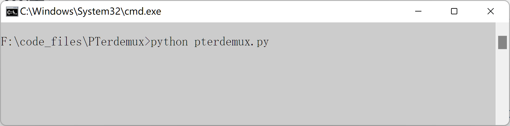
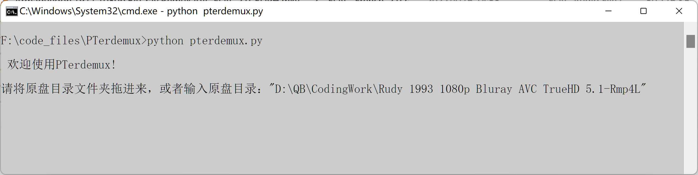
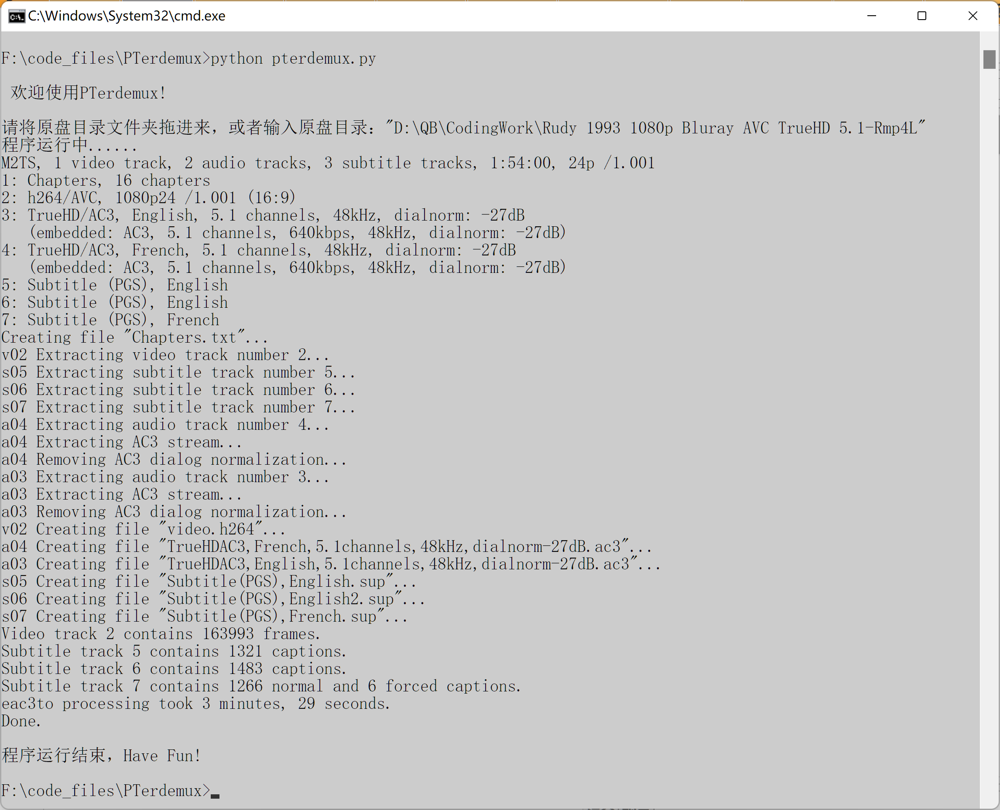

# PTerdemux

## 主要功能

无需写eac3to代码，自动分离原盘中的视频、音频、章节、字幕轨道，其中音频部分涉及转换格式。所有转换均参照猫站PTer压制组标准

## 用法：

(1) CMD进入到pterdemux.py所在的目录下

(2) 运行'python pterdemux.py'

(3) 拖动原盘目录到cmd窗口(支持将NAS中的原盘拖进来)，或者直接输入原盘目录的地址(注意地址要用引号引起)，回车。

(4) 等待程序运行，结束后会在cmd窗口显示并生成eac3to的log文件。

## 简单的说明：

* 需要安装python及eac3to，并将其加入环境变量。
* 原盘目录不要有中文
* 章节、视频、字幕均为无损提取。
  * 提取的章节后缀名为.txt
  * 提取的视频后缀名保持原格式，为.h264或.h265
  * 提取的字幕后缀名保持原格式，一般为.sup
* 音频提取按照猫站PTer压制组720p标准。
  * 适用于不带评论音轨的原盘提取
  * 1.0及2.0声道转为FLAC格式，如果是24bits，则降为16bits
  * 5.1及7.1声道转为AC3，码率为640kbps
 
